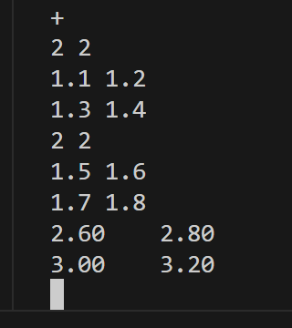
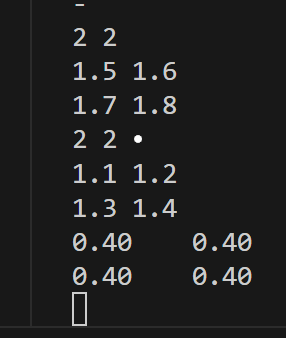
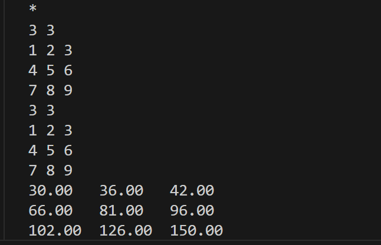
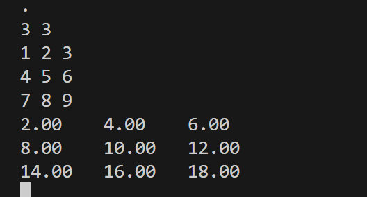
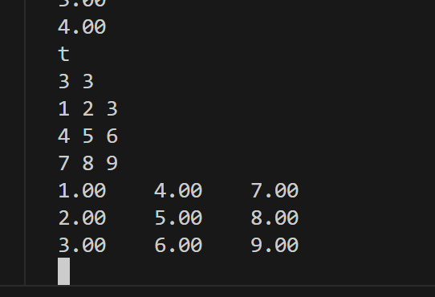
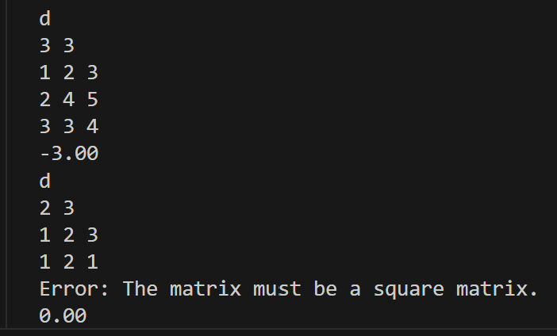
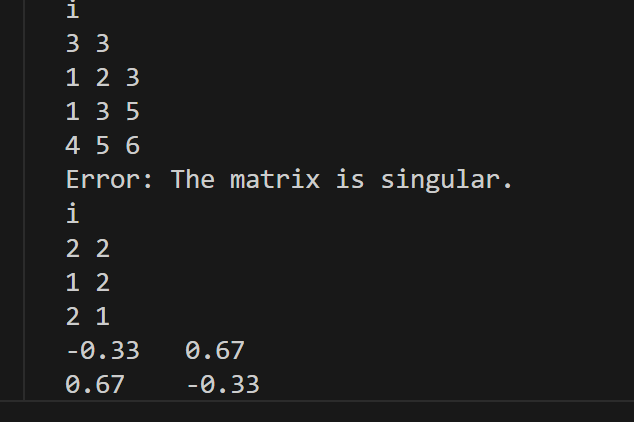
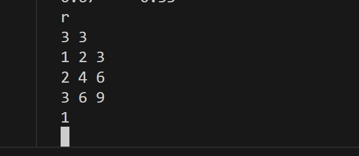
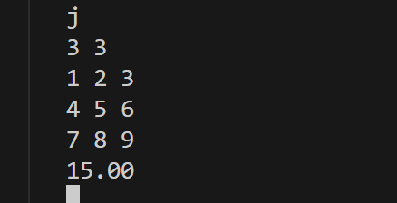

每个函数的运行结果
函数1：Matrix add_matrix(Matrix a, Matrix b)
运行结果：

函数2：Matrix sub_matrix(Matrix a, Matrix b);
运行结果：

函数3：Matrix mul_matrix(Matrix a, Matrix b);
运行结果：

函数4：Matrix scale_matrix(Matrix a, double k);
运行结果：

函数5：Matrix transpose_matrix(Matrix a);
运行结果：

函数6：double det_matrix(Matrix a);
运行结果：

函数7：Matrix inv_matrix(Matrix a);
运行结果：

函数8：rank_matrix(Matrix a);
运行结果：

函数9：double trace_matrix(Matrix a);
运行结果：

复杂函数的一些编程思路：
1.函数det_matrix():数学上应用拉普拉斯定理计算行列式，首先计算n=1和2的基本情况，再进行递归，排除当前元素所在的行和列，创建(n-1)×(n-1)的子矩阵，最后累加行列式值得到；

2.函数inv_matrix():
将原矩阵a与单位矩阵I拼接成[a|I]形式,高斯消元,逐行处理，寻找非零主元（必要时行交换）,主元归一化（使对角线元素变为1）,消去当前列其他行的元素,最后提取逆矩阵